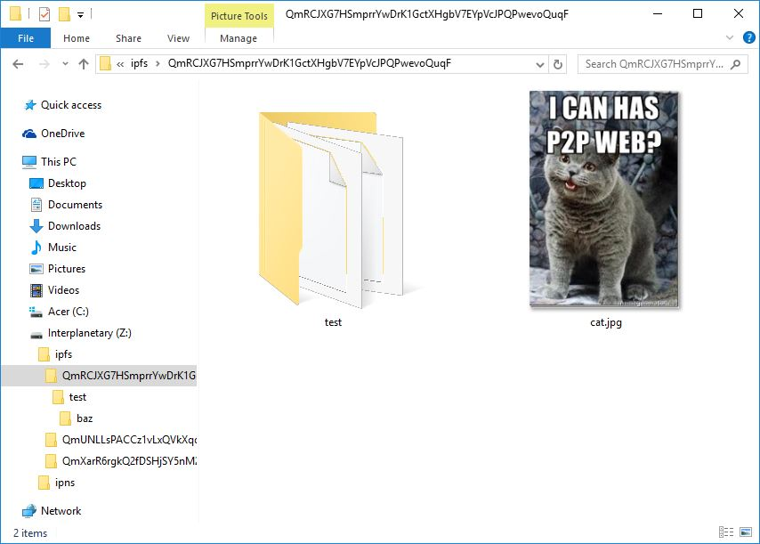

# net-ipfs-mount
[](https://ci.appveyor.com/project/richardschneider/net-ipfs-mount)
[](https://coveralls.io/github/richardschneider/net-ipfs-mount?branch=master)
[](https://chocolatey.org/packages/ipfs-mount)

Mount the [InterPlanetary File System](https://ipfs.io/) as a mapped drive on Windows.

## Features

- Mounts IPFS and IPNS on a drive letter, `ipfs-mount z:`
- Unmounts the drive, `ipfs-mount z: /u`
- [Pinned files](https://github.com/ipfs/examples/blob/master/examples/pinning/readme.md) are available in `z:\ipfs`
- Root contains shortcut to the IPFS WebUI

## Installation

[IPFS](https://ipfs.io/) and [Dokany](https://dokan-dev.github.io/) are required.  If not already installed, they can be installed with [choco](https://chocolatey.org/). 
Installation of Dokany requires [administrator rights](http://www.howtogeek.com/194041/how-to-open-the-command-prompt-as-administrator-in-windows-8.1/).

    > choco install ipfs
    > ipfs init
    > choco install dokany

Then install `ipfs-mount`

    > choco install ipfs-mount

## Quick start

    > ipfs-mount z 
    > dir z:\ipfs\QmRCJXG7HSmprrYwDrK1GctXHgbV7EYpVcJPQPwevoQuqF /B/S

````
z:\ipfs\QmRCJXG7HSmprrYwDrK1GctXHgbV7EYpVcJPQPwevoQuqF\cat.jpg
z:\ipfs\QmRCJXG7HSmprrYwDrK1GctXHgbV7EYpVcJPQPwevoQuqF\test
z:\ipfs\QmRCJXG7HSmprrYwDrK1GctXHgbV7EYpVcJPQPwevoQuqF\test\bar
z:\ipfs\QmRCJXG7HSmprrYwDrK1GctXHgbV7EYpVcJPQPwevoQuqF\test\baz
z:\ipfs\QmRCJXG7HSmprrYwDrK1GctXHgbV7EYpVcJPQPwevoQuqF\test\foo
z:\ipfs\QmRCJXG7HSmprrYwDrK1GctXHgbV7EYpVcJPQPwevoQuqF\test\baz\b
z:\ipfs\QmRCJXG7HSmprrYwDrK1GctXHgbV7EYpVcJPQPwevoQuqF\test\baz\f
````

## Options

````
Usage: ipfs-mount drive [OPTIONS]
Options:
  -s, --server=VALUE         IPFS API server address
  -u, --unmount              Unmount the drive
  -d, --debug                Display debugging information
  -h, -?, --help             Show this help
````
    
## Example

A screen shot of Windows explorer displaying the contents of `z:\ipfs\QmRCJXG7HSmprrYwDrK1GctXHgbV7EYpVcJPQPwevoQuqF`



